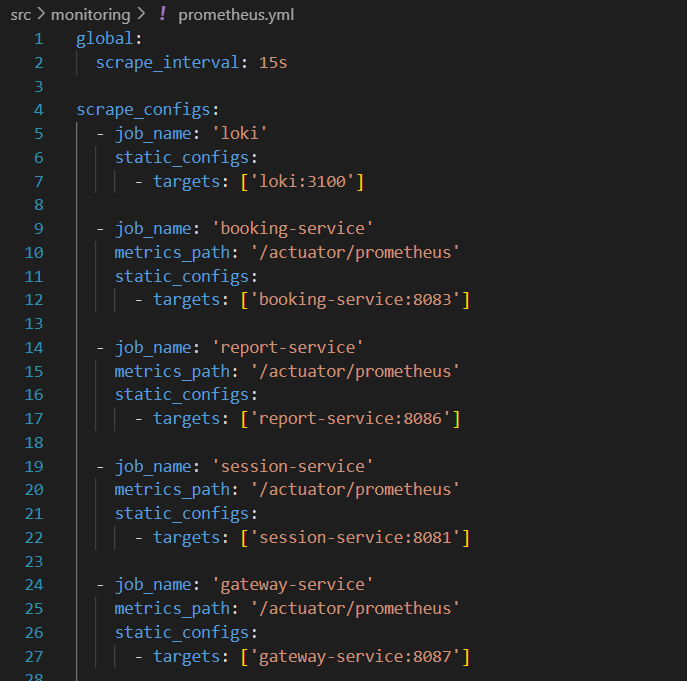
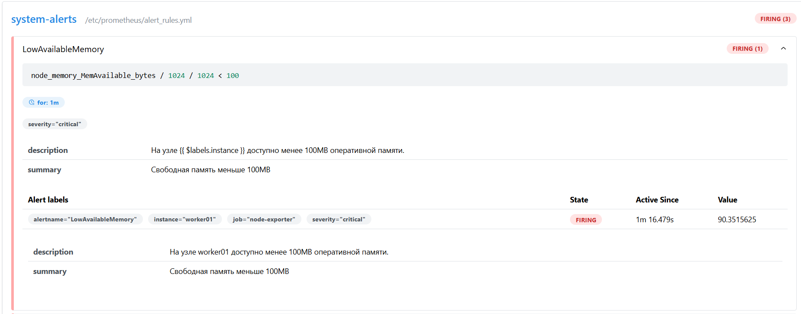

# Monitoring
Настройка получения и мониторинга метрик и логов сервиса про бронированию отелей.

## Отчет по выполнению проекта Devops 9. Мониторинг

## Part 1. Получение метрик и логов

В этой главе настроил Prometheus и Loki для сбора метрик и логов приложения.

1) Скопировал нужные файлы для выполнения проекта из проекта Devops 7. Docker Swarm. Фундаментом является развернутое приложение через docker swarm на 3 хостах через Vagrant.

> Список всех узлов в кластере Docker Swarm

> Все активные сервисы

> Приложение работает корректно

2) Написал при помощи библиотеки Micrometer сборщики следующих метрик приложения: 
   - количество отправленных сообщений в rabbitmq;
   - количество обработанных сообщений в rabbitmq;
   - количество бронирований;
   - количество полученных запросов на gateway;
   - количество полученных запросов на авторизацию пользователей.

В сервисы booking, report, gateway и session для получения метрик нужно внести следующие изменения: 
   - Добавить зависимости в pom.xml.

    
   > pom.xml

   - Добавить эндпоинты приложения, по которым будут доступны метрики через HTTP.

   
   > application.properties

   - Для booking-service прописать в BookingServiceImplementation.java счетчики, отвечаюищие за количество отправленных сообщений в rabbitmq и количество бронирований.
   
    
   > Внедрение счетчиков метрик

   - Для report-service прописать в файле QueueConsumer.java счетчик, отвечающий за количество обработанных сообщений в rabbitmq.

    
   > Внедрение счетчикa метрик

   - Для gateway-service прописать в файле MetricsFilte.java счетчик, отвечающий количество полученных запросов на gateway.

    
   > Внедрение счетчикa метрик

   - Для session-service прописать в файле SessionController.java счетчик, отвечающий за количество полученных запросов на авторизацию пользователей.

    
   > Внедрение счетчикa метрик

Так как образы контейнеры подтягиваются с докер хаба, собрал измененные сервисы и запушил.

 
> Выполнил docker build для booking-service

 
> Выполнил docker push для booking-service

3) Добавил логи приложения с помощью Loki.

 
> Написал конфиг loki

 
> Написал конфиг экспортера promtail для loki

4) Создал новый стек для docker swarm из сервисов с Prometheus Server, Loki, node_exporter, blackbox_exporter, cAdvisor. Проверил получение метрик на порту 9090 через браузер.

 
> Написал docker-compose.monitoring.yml для стека мониторинга 

 
> Написал prometheus.yml

 
> Написал blackbox.yml для проверки доступности сервисов

<pre>sudo docker stack deploy -c docker-compose.monitoring.yml monitoring</pre>

 
> Запущенный стек мониторинга

Перешел на http://localhost:9090 для проверки получения метрик прометеусом. 

 
> Активные targets

 
> Метрики количества отправленных сообщений в rabbitmq; количества обработанных сообщений в rabbitmq; количества бронирований;

 
> Метрики количества полученных запросов на gateway; количества полученных запросов на авторизацию пользователей.

 
> Метрики node-exporter по нагрузке CPU.

 
> Метрики cadvisor по использованию ресурсов контейнерами сервисов.

 
> Метрики blackbox по доступности сервисов.

 
> Логи сервисов.

## Part 2. Визуализация

В этой главе настроил Grafana для визуализации метрик и логов.

1) Развернул grafana как новый сервис в стеке мониторинга.

 
> Новый сервис grafana.

2) Добавил в grafana дашборд со следуюшими метриками:
   - количество нод;
   - количество контейнеров;
   - количество стеков;
   - использование CPU по сервисам;
   - использование CPU по ядрам и узлам;
   - затраченная RAM;
   - доступная и занятая память;
   - количество CPU;
   - доступность google.com;
   - количество отправленных сообщений в rabbitmq;
   - количество обработанных сообщений в rabbitmq;
   - количество бронирований;
   - количество полученных запросов на gateway;
   - количество полученных запросов на авторизацию пользователей;
   - логи приложения.

 
> Добавил в источники loki и prometheus.

 
> Метрики количества нод, контейнеров, стеков; использование CPU по сервисам.

 
> Метрики использования CPU по ядрам и узлам; затраченная RAM; - доступная и занятая память; количество CPU; доступность google.com;

 
> Метрики количества отправленных сообщений в rabbitmq,обработанных сообщений в rabbitmq, бронирований, полученных запросов на gateway;

 
> Метрики количества полученных запросов на авторизацию пользователей и логи приложения.

## Part 3. Отслеживание критических событий

В этой главе настроил Alert Manager для оповещения о критических событиях.

1) Развернул alert manager как новый сервис в стеке монтиторинга.

 
> Добавил сервис alert manager.

2) Добавил следующие критические события:
   - доступная память меньше 100 мб;
   - затраченная RAM больше 1гб;
   - использование CPU по сервису превышает 10%.

 
> Написал скрипт для критических событий. 

 
> Прописал условия срабатывания алертов в конфиг прометеуса.

3) Настроил получение оповещений через личные email и телеграм.

 
> Написал конфигурацию alert manager для отправки сообщений на почту и телеграмм бота.

 
> Запустившиеся алерты.

При помощи команды создавал искусственную нагрузку на узлах, чтобы проверить работоспособность оповещений.
<pre>stress --cpu 2 --vm 1 --vm-bytes 600M --vm-hang 0</pre>

 
> Возникновение алерта из за уменьшения свободной памяти на worker01. 

 
> Возникновение алертов из за увеличения потребления RAM на manager01 и worker01. 

 
> Возникновение алерта из за увеличения использования CPU у сервиса cadvisor.

 
> Оповещение об алертах на личную почту. 

 
> Оповещение об алертах в тг боте. 